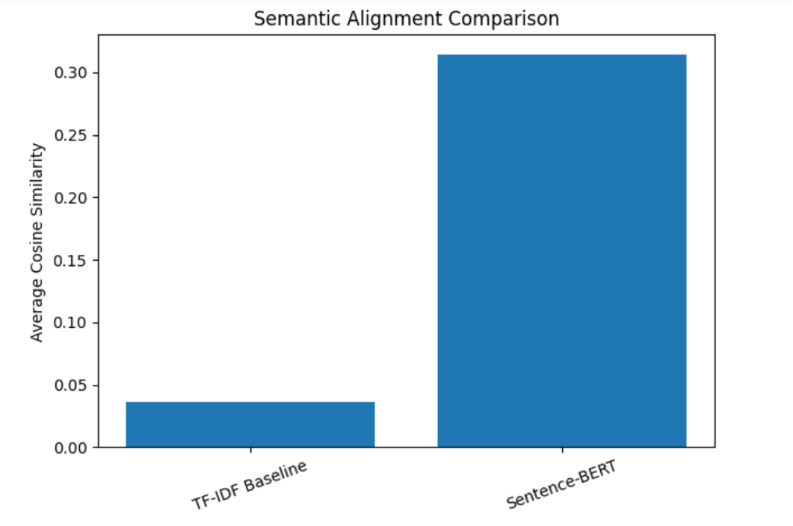

# llm-semantic-resume-alignment
LLM-based semantic alignment framework for resume-job matching with statistical validation.
# LLM-Based Semantic Resume Alignment Framework

## Overview
This repository presents a semantic alignment framework for resume-job matching using transformer-based embeddings. The study compares traditional TF-IDF similarity with Sentence-BERT embeddings and evaluates performance using statistical validation.

---

## Objective
The primary objective of this research is to evaluate whether contextual embedding models improve semantic alignment between resumes and job descriptions compared to lexical keyword-based approaches.

---

## Dataset
- 60 resume PDFs (real-world format)
- Diversified job descriptions across technical domains
- Text extracted from PDF documents for analysis

---

## Methodology

### 1. Text Extraction
Resume content was extracted from PDF files using PyPDF2.

### 2. Baseline Model
- TF-IDF vectorization
- Cosine similarity computation

### 3. Proposed Model
- Sentence-BERT (`all-MiniLM-L6-v2`)
- Embedding-based cosine similarity

### 4. Statistical Validation
- Paired t-test performed to evaluate statistical significance of improvement.

---

## Results

| Metric | Baseline (TF-IDF) | Proposed (Sentence-BERT) |
|--------|------------------|--------------------------|
| Avg. Cosine Similarity | 0.036 ± 0.025 | 0.314 ± 0.078 |
| Statistical Significance | – | p < 0.001 |

The embedding-based model demonstrated statistically significant improvement in semantic alignment across 60 resume-job pairs.

---

## Figure



*Figure 1. Comparison of average cosine similarity between TF-IDF baseline and Sentence-BERT embeddings.*

---

## Reproducibility

To reproduce the experiment:

1. Install dependencies:
   ```
   pip install sentence-transformers scikit-learn numpy pandas scipy PyPDF2
   ```

2. Run the Jupyter notebook:
   ```
   semantic_alignment_experiment.ipynb
   ```

---

## Limitations

- Job descriptions are template-based but diversified.
- Study focuses on cosine similarity as evaluation metric.
- Future work includes larger datasets and bias-aware evaluation.

---

## Author

Smriti

Data Science Research Project
